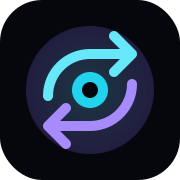

<p align="center">
  
</p>

# OmniEdge RouteIQ

**A local-first AI routing control plane for token efficiency, privacy-aware execution, cloud escalation, fallback reliability, and explainable audit trails.**

[Live Demo](https://omniedge-routeiq.vercel.app) ·
[API Docs](https://omniedge-routeiq-backend.onrender.com/docs) ·
[Backend Status](https://omniedge-routeiq-backend.onrender.com/status)

---

## AMD ACT II — Final Observed Track 1 Result

The final qualified leaderboard snapshot observed near the close of the AMD Developer Hackathon: ACT II was:

| Metric | Final observed result |
|---|---:|
| Track | Hybrid Token-Efficient Routing Agent |
| Leaderboard position | **17th** |
| Accuracy | **94.7%** |
| Fireworks tokens | **3,100** |
| Qualified tasks | **18 of 19** |
| Initial qualified baseline | 12,531 tokens at 84.2% accuracy |
| Token reduction from initial baseline | **75.3%** |
| Status | Qualified, scored, and preserved |

The team stopped further high-risk experiments during the closing hours to protect the qualified score and avoid losing the position through regressions, schema errors, timeouts, or infrastructure failures.

> This is the final leaderboard result observed by the team. Prize decisions, manual reviews, or organizer-side adjustments may be reported separately.

### Benchmark progression

| Stage | Accuracy | Fireworks tokens | Outcome |
|---|---:|---:|---|
| Early qualified run | 84.2% | 12,531 | Established a valid scoring baseline |
| Major optimization | 94.7% | 3,974 | Reached the top 10 in an earlier snapshot |
| Local-first experiment | 89.5% | 3,421 | Lower token use, but accuracy regressed |
| Final preserved run | **94.7%** | **3,100** | Finished at the observed **17th position** |

### Final experimental learning

A separate v1.8.1 single-pass local candidate completed an internal 19-task benchmark using deterministic solvers and local inference without Fireworks calls. It reached 18 of 19 locally, but the team did not treat it as the final protected submission because one incorrect answer could have reduced the official score.

This experiment remains useful research for future zero-token routing work.

---

## What RouteIQ Does

Most AI applications send every request to the same cloud model. RouteIQ places a routing layer between the application and the inference providers.

For each request, it considers:

- privacy sensitivity;
- task type and complexity;
- local solver confidence;
- latency constraints;
- estimated token cost;
- provider availability;
- fallback reliability;
- required output format.

It then selects an execution path and records the decision.

```text
Application request
        ↓
Task and policy analysis
        ↓
Deterministic local solver
        ↓
Local model when suitable
        ↓
Approved cloud model only when required
        ↓
Validation and answer normalization
        ↓
Result + metrics + explainable audit trail
```

The product principle is simple:

> Do not send every prompt to the cloud by default. Route it intelligently.

---

## Two Working Layers

### 1. Track 1 scoring agent

The containerized benchmark agent follows the official evaluator contract:

```text
Input:  /input/tasks.json
Output: /output/results.json
```

The agent:

- reads all supplied tasks;
- preserves each `task_id`;
- uses deterministic local solvers where confidence is high;
- uses local inference for selected unresolved tasks;
- escalates only when needed and permitted;
- writes benchmark-compatible JSON;
- targets `linux/amd64`;
- respects evaluator-provided model and environment constraints.

### 2. Command Nexus product dashboard

The product layer demonstrates how the routing engine can be used in practical enterprise systems.

It includes:

- route decision visibility;
- local, cloud, hybrid, and fallback paths;
- token savings indicators;
- latency metrics;
- provider health;
- simulation scenarios;
- consent and audit concepts;
- an explainable event timeline.

---

## Core Features

- Local-first execution for supported tasks
- Deterministic arithmetic, sentiment, logic, code, NER, and summary handling
- Local model inference for selected unresolved tasks
- Controlled Fireworks AI fallback
- Strict output validation and normalization
- Token-use reduction
- Privacy-aware route selection
- Provider fallback handling
- Metrics and audit trail
- Dockerized evaluator adapter
- Public Next.js dashboard and FastAPI backend

---

## Product Architecture

```text
User or application
        ↓
Next.js Command Nexus dashboard
        ↓
FastAPI routing API
        ↓
Routing classifier and policy engine
        ↓
Provider registry
   ┌────┼─────────────┐
   ↓    ↓             ↓
Local  Cloud        Fallback
   └────┼─────────────┘
        ↓
Normalized response
        ↓
Metrics + audit timeline
        ↓
Dashboard visualization
```

### Route types

| Route | Purpose |
|---|---|
| Local | Sensitive, simple, or deterministic tasks suitable for local execution |
| Cloud | Complex public tasks requiring stronger remote inference |
| Hybrid | Privacy-aware processing with controlled escalation |
| Fallback | Recovery when a preferred provider is unavailable |

---

## Live Links

| Layer | Link |
|---|---|
| Frontend demo | https://omniedge-routeiq.vercel.app |
| Backend API documentation | https://omniedge-routeiq-backend.onrender.com/docs |
| Backend health check | https://omniedge-routeiq-backend.onrender.com/status |
| Source repository | https://github.com/kaulastudies/omniedge-routeiq |

---

## API Endpoints

```text
GET  /status
GET  /metrics
GET  /simulations
POST /simulations/{scenario_id}
POST /route
GET  /audit/recent
```

Example:

```bash
curl -X POST \
  https://omniedge-routeiq-backend.onrender.com/route \
  -H "Content-Type: application/json" \
  -d '{
    "prompt": "Summarize this confidential enterprise incident report and identify risks.",
    "task_type": "summarization",
    "privacy_level": "confidential",
    "max_latency_ms": 2000,
    "prefer_local": true
  }'
```

---

## Demo Scenarios

| Scenario | Demonstrates |
|---|---|
| `local_sensitive_prompt` | Privacy-aware local-first routing |
| `cloud_complex_architecture` | Cloud-capable reasoning |
| `hybrid_confidential_code` | Hybrid handling for confidential code |
| `fallback_no_key_demo` | Recovery when a cloud key or provider is unavailable |

---

## Tech Stack

### Scoring agent

- Python
- Deterministic local solvers
- Local Qwen inference experiments
- Fireworks AI fallback
- Docker
- GitHub Actions
- GHCR
- Linux AMD64 packaging

### Product backend

- Python
- FastAPI
- Pydantic
- Provider abstraction
- Render

### Product frontend

- Next.js
- TypeScript
- Tailwind CSS
- Framer Motion
- lucide-react
- Vercel

---

## Team and Current Ownership

The table below separates core hackathon ownership from responsibilities assigned for continued project development.

| Member | Current ownership |
|---|---|
| **Rama Chandra** | Founder and Product/Architecture Lead. Owns product direction, routing architecture, benchmark strategy, backend decisions, Docker scoring flow, final technical approval, partnerships, and future pilot direction. |
| **Nabothan** | Frontend and UI Contributor. Owns Command Nexus interface work, route visualization, dashboard usability, frontend integration quality, and presentation polish. |
| **Rameen** | QA, Product, and Documentation Contributor. Owns functional QA, scenario testing, demo-flow review, submission-story support, documentation review, and backend simulation validation. |
| **Priyanka Pandey** | Project Operations and Documentation Support. Owns README maintenance, benchmark evidence records, release notes, public-link verification, project archive upkeep, issue-status summaries, and post-hackathon documentation coordination. |

### Responsibilities moved from the founder to Priyanka Pandey

To reduce founder overload and make project maintenance more consistent, the following work is assigned to Priyanka going forward:

| Responsibility | Priyanka's ownership | Rama's involvement |
|---|---|---|
| Root README and documentation index | Maintain current information and formatting | Final approval for technical claims |
| Benchmark and leaderboard evidence | Record dated screenshots, scores, image labels, and result notes | Confirm which result is safe to publish |
| Release notes and changelog | Summarize meaningful releases and experiments | Approve release status |
| Public-link checks | Verify demo, API docs, backend status, and repository links | Handle technical fixes |
| Project archive | Organize final screenshots, pitch files, demo notes, and submission evidence | Provide missing founder/technical material |
| Weekly project status | Collect updates from the team and prepare a short status summary | Set priorities and decisions |
| Issue and PR summary | Maintain a clear open/closed/in-review list | Review and merge technical changes |

Priyanka's assignment is for current and future project operations. It does not retroactively attribute core routing-agent or frontend code that was completed before she joined the workstream.

See [docs/TEAM_OWNERSHIP.md](docs/TEAM_OWNERSHIP.md) for the detailed operating model.

---

## Local Development

### Backend

```bash
cd backend
python -m venv .venv
source .venv/bin/activate
pip install -r requirements.txt
cp .env.example .env
uvicorn app.main:app --host 0.0.0.0 --port 8000
```

### Frontend

```bash
cd frontend
npm install
npm run dev -- --hostname 0.0.0.0
```

Never commit real credentials. Store only placeholders in `.env.example`.

---

## Deployment

### Render backend

```text
Root Directory: backend
Build Command: pip install -r requirements.txt
Start Command: uvicorn app.main:app --host 0.0.0.0 --port $PORT
```

Typical environment configuration:

```text
ENVIRONMENT=production
ENABLE_MOCK_CLOUD=true
ENABLE_FIREWORKS=false
ENABLE_OLLAMA=false
CORS_ORIGINS=["http://localhost:3000","https://omniedge-routeiq.vercel.app"]
```

### Vercel frontend

```text
Root Directory: frontend
Build Command: npm run build
Install Command: npm install
```

```text
NEXT_PUBLIC_API_BASE_URL=https://omniedge-routeiq-backend.onrender.com
```

---

## Repository Structure

```text
omniedge-routeiq/
├── backend/
│   ├── app/
│   ├── tests/
│   ├── Dockerfile
│   ├── render.yaml
│   └── requirements.txt
├── frontend/
│   ├── src/
│   ├── public/
│   └── package.json
├── track1-*/
│   ├── agent.py
│   ├── local/
│   ├── tests/
│   └── Dockerfile*
├── docs/
│   ├── README.md
│   ├── TEAM_OWNERSHIP.md
│   ├── HACKATHON_RESULT.md
│   ├── architecture.md
│   ├── demo-script.md
│   ├── judging-alignment.md
│   ├── testing-checklist.md
│   └── assets/
├── scripts/
└── README.md
```

---

## Post-Hackathon Priorities

1. Preserve the final scored image, result evidence, and submission history.
2. Reproduce the 19-task benchmark under a documented local test harness.
3. Improve local factual-answer reliability without overfitting to one test set.
4. Add regression gates for accuracy, schema validity, runtime, and missing tasks.
5. Unify the scoring agent and product dashboard through a shared routing-policy layer.
6. Prepare small pilot demonstrations for privacy-sensitive and cost-sensitive workflows.
7. Maintain honest documentation separating evaluated results, internal experiments, and future claims.

---

## Documentation

Start with the [documentation index](docs/README.md).

Key records:

- [Hackathon result](docs/HACKATHON_RESULT.md)
- [Team ownership](docs/TEAM_OWNERSHIP.md)
- [Architecture](docs/architecture.md)
- [Demo script](docs/demo-script.md)
- [Judging alignment](docs/judging-alignment.md)
- [Testing checklist](docs/testing-checklist.md)

---

## Project Status

OmniEdge RouteIQ is a **working hackathon prototype and continuing R&D project**. The repository includes a live product demonstration, a backend routing API, benchmark-agent experiments, test tooling, and evaluation evidence.

It is not yet presented as a production-certified enterprise platform. Security review, broader benchmarking, cost validation, model governance, and pilot testing remain part of the next stage.

---

Built by the OmniEdge RouteIQ team for the AMD Developer Hackathon: ACT II.
